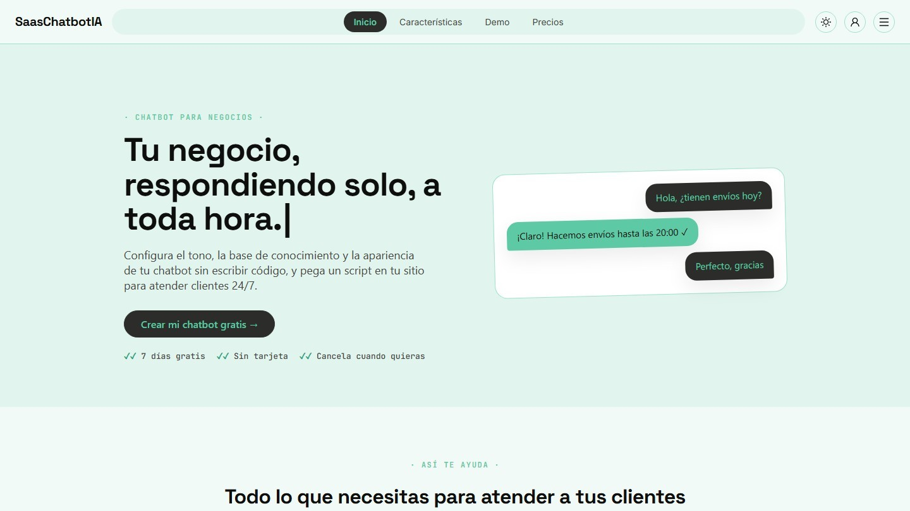

<div align="center">

# 🤖 SaasChatbotIA

**Crea el chatbot de atención al cliente de tu negocio en minutos, sin escribir una línea de código.**

[](package.json)
[](https://react.dev)
[](https://www.typescriptlang.org)
[](https://vitejs.dev)
[](https://supabase.com)
[](https://groq.com)

[Demo en vivo](https://saaschatbotia.vercel.app) · [Reportar un bug](https://github.com/nicolassarmiento28/SaasChatbot/issues)

</div>

---

## 📖 Qué es SaasChatbotIA

**SaasChatbotIA** es un SaaS pensado para dueños de negocios pequeños (restaurantes, clínicas, tiendas online, inmobiliarias) que quieren ofrecer atención al cliente 24/7 sin contratar personal técnico ni escribir código.

Desde un dashboard simple, el dueño del negocio:

1. Configura su bot (nombre, tono, colores, base de conocimiento).
2. Lo prueba en un mini-chat en vivo.
3. Copia un `<script>` y lo pega en su sitio web.

El bot queda operativo al instante, respondiendo preguntas frecuentes en el idioma del visitante, mostrando botones de acción (reservar, pedir por WhatsApp, ver menú) y escalando a revisión humana cuando no tiene una respuesta confiable.

**¿Para quién es?** Negocios pequeños sin equipo técnico que hoy no pueden pagar (ni justificar) un chatbot a medida.

---

## 🔗 Demo en vivo

👉 **[saaschatbotia.vercel.app](https://saaschatbotia.vercel.app)**

La landing incluye un demo interactivo del bot sin necesidad de registrarte.



---

## ✨ Funcionalidades

**🏠 Landing**
- Demo en vivo del chatbot embebido en la propia landing.
- Modo claro/oscuro con persistencia, diseño responsive.

**🔐 Autenticación**
- Registro/login con email+contraseña o magic link (Supabase Auth).
- Creación automática del negocio (`businesses`) al registrarse, vía trigger de Postgres.

**🚀 Onboarding guiado (5 pasos)**
- Elegir plantilla por rubro (restaurante, clínica, tienda online, inmobiliaria) o empezar desde cero.
- Configurar datos del negocio y del bot con **preview en vivo** del widget.
- Cargar base de conocimiento inicial (texto, FAQ o documento).
- Probar el bot en un mini-chat antes de publicar.
- Copiar el snippet de instalación.

**⚙️ Configuración del bot**
- Nombre, tono, color de marca, avatar.
- Plantillas de personalidad por industria con FAQs precargadas.
- Hasta 3 botones de acción (CTA) configurables (label + URL, validados server-side).
- Modo multilenguaje automático: detecta el idioma del visitante y responde en ese mismo idioma, incluso si cambia a mitad de conversación.
- Activar/desactivar el bot, límites de bots según el plan contratado.
- Base de conocimiento con fuentes de tipo texto, FAQ o documento (PDF/txt subido a Storage).

**📊 Dashboard**
- Conversaciones en tiempo real (Supabase Realtime), con filtros por bot, origen, fecha y "necesita revisión".
- Detalle de cada hilo, marcado de respuestas de baja confianza y botón para agregarlas a la base de conocimiento.
- Gráfico de uso mensual, comparación de planes y alertas proactivas de cuota.
- **Insights semanales generados por IA**: preguntas frecuentes, temas sin respuesta clara y sugerencias de mejora, cacheados por negocio/semana.

**💬 Widget embebible**
- Vanilla JS sin dependencias, aislado con Shadow DOM (no choca con los estilos del sitio anfitrión).
- Botón flotante + panel de chat, historial de conversación, botones CTA clickeables.

**🔒 Seguridad**
- Row Level Security (RLS) en todas las tablas de negocio: aislamiento estricto por `business_id`/`owner_id`.
- Rate limiting atómico (RPC de Postgres con advisory lock) por `visitor_id` + IP + `bot_id`.
- Constraint a nivel de base de datos que rechaza esquemas de URL peligrosos (`javascript:`, `data:`, `vbscript:`) en los botones CTA.
- Whitelist de tipo MIME y tamaño en los buckets de Storage.
- Guardrail anti prompt-injection y CORS restringido en los endpoints que exponen datos privados.
- Secretos (`GROQ_API_KEY`, `service_role key`) solo viven en Edge Functions, nunca en el cliente.

---

## 🛠️ Stack tecnológico

| Tecnología | Uso | Por qué se eligió |
|---|---|---|
| **React + Vite + TypeScript** | Landing y dashboard | Desarrollo rápido, tipado estricto, build ligero |
| **Ant Design** | Sistema de componentes UI | Componentes accesibles y consistentes listos para producción |
| **Supabase (Auth)** | Autenticación de dueños de negocio | Auth gestionada, magic links, integración directa con RLS |
| **Supabase (Postgres + RLS)** | Base de datos y aislamiento multi-tenant | RLS a nivel de fila evita fugas entre negocios sin lógica extra en el backend |
| **Supabase (Storage)** | Avatares y documentos de base de conocimiento | Buckets con políticas de acceso y whitelist de tipo MIME |
| **Supabase (Realtime)** | Conversaciones en vivo en el dashboard | Suscripciones a cambios en Postgres sin infraestructura adicional |
| **Supabase Edge Functions (Deno)** | `chat`, `insights` | Ejecuta lógica server-side cerca de la DB, mantiene secretos fuera del cliente |
| **Groq API (`llama-3.1-8b-instant`)** | Motor de IA del chatbot | Latencia muy baja y costo bajo, ideal para respuestas conversacionales cortas |
| **Vanilla JS (widget)** | Script embebible en sitios de terceros | Cero dependencias y Shadow DOM para no interferir con el sitio anfitrión |
| **Vitest + Testing Library** | Tests unitarios y de componentes | Integración nativa con Vite, rápido en CI local |
| **Vercel** | Deploy del frontend | Deploy automático por push, preview URLs |

---

## 🏗️ Arquitectura

```
                     ┌──────────────────────────┐
                     │   Landing / Dashboard      │
                     │   (React + Vite + AntD)    │
                     └────────────┬───────────────┘
                                  │ Supabase Auth + PostgREST (con RLS)
                                  ▼
┌──────────────┐        ┌──────────────────────────┐
│  Widget (JS)  │──────▶│   Supabase Edge Functions  │
│  en sitios    │  HTTP  │   ┌────────┐ ┌──────────┐ │
│  de terceros  │        │   │  chat  │ │ insights │ │
└──────────────┘        │   └───┬────┘ └────┬─────┘ │
                         └───────┼───────────┼───────┘
                                 │           │
                       ┌─────────▼──┐   ┌────▼─────────┐
                       │  Groq API   │   │  Postgres DB  │
                       │ (LLM)       │   │  (RLS + RPC)  │
                       └─────────────┘   └───────────────┘
```

**Puntos clave:**
- El navegador **nunca** llama directo a Groq ni usa la `service_role key`: todo pasa por las Edge Functions `chat` e `insights`, que agregan la API key server-side.
- El widget usa un `visitor_id` anónimo (localStorage) y solo accede a datos públicos vía Edge Functions — nunca consulta tablas directamente con la `anon key`.
- El flujo del chat: el widget envía `{ bot_id, visitor_id, message, conversation_id }` → la función arma el prompt (`system_prompt` + base de conocimiento + historial) → llama a Groq → guarda la respuesta → actualiza métricas de uso.

**Tablas principales:**

| Tabla | Propósito |
|---|---|
| `businesses` | Cuenta del negocio, dueño (`owner_id`), plan contratado |
| `bots` | Configuración del chatbot (prompt, tono, color, CTA buttons, activo) |
| `knowledge_sources` | Fragmentos de conocimiento (FAQ/documento/texto) |
| `conversations` | Una conversación entre un visitante y un bot |
| `messages` | Mensajes individuales de una conversación |
| `usage_metrics` | Contador mensual de mensajes por negocio (límites de plan) |
| `insights` | Resumen semanal generado por IA, cacheado por negocio/semana |
| `rate_limit_events` | Eventos usados para calcular ventanas de rate limiting |

---

## 📂 Estructura del proyecto

```
SaasChatbotIA/
├── specs/                    # Especificaciones (Spec Driven Development) — leer antes de codear
├── src/
│   ├── features/
│   │   ├── auth/              # Registro, login, recuperación de contraseña
│   │   ├── onboarding/        # Flujo guiado de 5 pasos
│   │   ├── bots/               # Configuración del bot, CTA buttons, base de conocimiento
│   │   ├── dashboard/          # Conversaciones, métricas, insights
│   │   └── landing/            # Landing page y demo en vivo
│   ├── shared/                # Componentes y utils compartidos
│   └── widget/                 # Widget vanilla JS embebible
├── supabase/
│   ├── functions/
│   │   ├── chat/                # Edge Function del chat (prompt, rate limiting, Groq)
│   │   ├── insights/             # Edge Function de insights semanales
│   │   └── _shared/               # Validación y utilidades compartidas
│   └── migrations/              # Migraciones SQL (schema, RLS, constraints)
├── tests/                      # Tests unitarios, de componentes e integración (Vitest)
└── vite.widget.config.ts       # Build separado para el widget embebible
```

---

## 🚀 Getting started

### Prerrequisitos

- **Node.js 20+**
- Una cuenta de [Supabase](https://supabase.com) y el [Supabase CLI](https://supabase.com/docs/guides/cli) (`npm i -g supabase`)
- Una API key de [Groq](https://console.groq.com) (tiene capa gratuita)

### 1. Clonar e instalar

```bash
git clone https://github.com/nicolassarmiento28/SaasChatbot.git
cd SaasChatbot
npm install
```

### 2. Variables de entorno

Copiá `.env.local.example` a `.env.local`:

```bash
cp .env.local.example .env.local
```

| Variable | Dónde | Descripción |
|---|---|---|
| `VITE_SUPABASE_URL` | `.env.local` | URL de tu proyecto Supabase |
| `VITE_SUPABASE_ANON_KEY` | `.env.local` | Clave pública (anon) de Supabase |
| `VITE_DEMO_BOT_ID` | `.env.local` | ID de un bot de ejemplo para el demo de la landing |
| `GROQ_API_KEY` | Secreto de Edge Function | API key de Groq — **nunca** en el cliente |
| `SUPABASE_SERVICE_ROLE_KEY` | Secreto de Edge Function | Clave con privilegios elevados, solo server-side |
| `DASHBOARD_ORIGIN` | Secreto de Edge Function | Dominio del dashboard permitido en CORS de `insights` |

### 3. Configurar Supabase

```bash
supabase login
supabase link --project-ref <tu-project-ref>

# Aplicar migraciones (schema, RLS, constraints)
supabase db push

# Configurar secretos de las Edge Functions
supabase secrets set GROQ_API_KEY=tu_key
supabase secrets set DASHBOARD_ORIGIN=https://tu-dashboard.vercel.app

# Desplegar las Edge Functions
supabase functions deploy chat
supabase functions deploy insights
```

### 4. Correr el proyecto localmente

```bash
npm run dev
```

---

## 👤 Cómo usar la app

1. **Registro** en `/auth` (email+contraseña o magic link) → se crea tu negocio automáticamente.
2. **Onboarding** (`/onboarding`): elegís una plantilla de industria, configurás el bot con preview en vivo, cargás conocimiento inicial y lo probás en un mini-chat.
3. **Dashboard** (`/dashboard`): desde acá seguís editando el bot, subiendo documentos, revisando conversaciones en tiempo real y viendo tus insights semanales.
4. **Publicar**: copiás el snippet de instalación y lo pegás en tu sitio — el bot queda activo para tus visitantes.

---

## 🔌 Widget embebible

Desde el dashboard o el último paso del onboarding, copiás un snippet como este y lo pegás antes del `</body>` de tu sitio:

```html
<script
  src="https://saaschatbotia.vercel.app/widget.js"
  data-bot-id="TU_BOT_ID"
  defer
></script>
```

El snippet solo necesita `data-bot-id`. La URL y la `anon key` de Supabase **no** se exponen en el HTML: quedan hardcodeadas dentro del bundle `widget.js` en tiempo de build (ver `vite.widget.config.ts`), igual que en cualquier otro build del frontend. El script carga los datos públicos del bot (nombre, color, avatar, si está activo) e inyecta un botón flotante + panel de chat aislado en **Shadow DOM**, para no chocar con los estilos del sitio anfitrión.

Para compilar el bundle del widget localmente:

```bash
npm run build:widget
```

---

## 🧪 Tests

```bash
npm test
```

Corre la suite de Vitest: tests unitarios de lógica (sanitización de inputs, detección de idioma, construcción de prompts) y de componentes (React Testing Library).

Algunos tests de integración están **desactivados por defecto** porque requieren un proyecto Supabase real (crean usuarios y datos de prueba vía Admin API):

```bash
RUN_RLS_INTEGRATION_TESTS=true \
VITE_SUPABASE_URL=... VITE_SUPABASE_ANON_KEY=... SUPABASE_SERVICE_ROLE_KEY=... \
npm test -- rls
```

Estos verifican, contra la base real: aislamiento RLS entre negocios, el constraint de esquemas de URL en `cta_buttons`, la whitelist de Storage y la atomicidad del rate limiting bajo concurrencia.

---

## ☁️ Deploy

**Frontend (Vercel)** — el proyecto ya está linkeado a Vercel:

```bash
vercel deploy          # preview
vercel deploy --prod   # producción
```

**Backend (Supabase)**:

```bash
supabase db push                    # aplicar migraciones nuevas
supabase functions deploy chat      # redeploy de una Edge Function
supabase functions deploy insights
```

---

## 📋 Spec Driven Development

Este proyecto sigue una metodología de **Spec Driven Development**: toda funcionalidad se especifica en `specs/` *antes* de escribir código. Las specs actuales:

| Spec | Contenido |
|---|---|
| `00-arquitectura.md` | Arquitectura general y esquema de base de datos |
| `01-landing.md` | Landing page y demo en vivo |
| `02-auth.md` | Registro, login y recuperación de contraseña |
| `03-onboarding.md` | Flujo guiado de 5 pasos |
| `04-bot-config.md` | Configuración del bot, plantillas, CTAs, multilenguaje |
| `05-widget.md` | Widget embebible |
| `06-dashboard.md` | Dashboard, conversaciones e insights |
| `07-seguridad.md` | Modelo de seguridad, RLS, rate limiting |
| `08-agente-revision-seguridad.md` | Agente de revisión de seguridad automatizado |

---

## 🗺️ Roadmap

- [ ] Más plantillas de personalidad por industria
- [ ] Soporte para más idiomas en la detección automática
- [ ] Integración de canales adicionales (WhatsApp, Instagram DM)
- [ ] Límites de plan más granulares (por feature, no solo por mensajes)
- [ ] Panel de analítica avanzada más allá de los insights semanales

---

<div align="center">

Hecho con ☕ para negocios pequeños.

</div>
